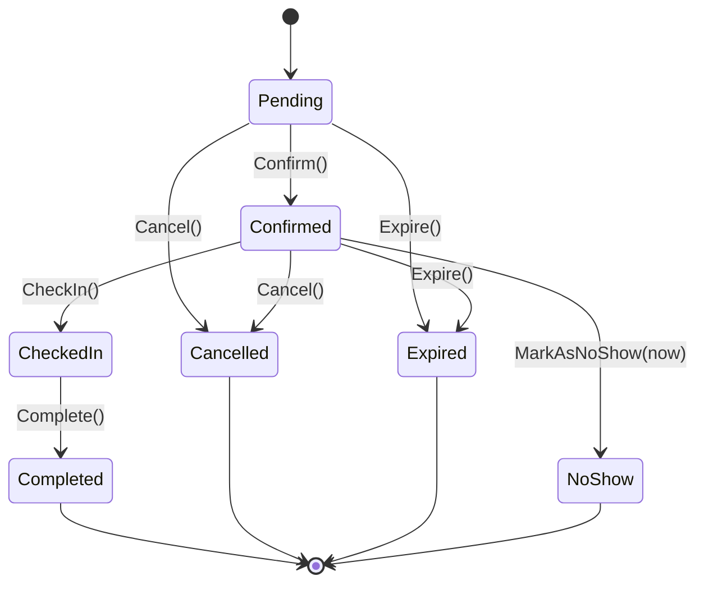
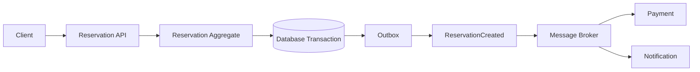
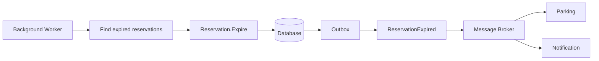
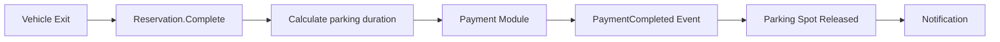
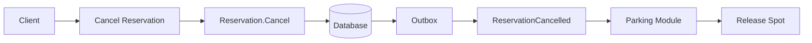

# ParkFlow — Smart Parking Management Platform

Day 22 capstone kickoff: architecture + scaffolding only, not the full feature set.

## Problem

Drivers waste time circling a facility looking for a free spot, and once they find one there's no
guarantee it will still be free — or billed correctly — by the time they leave. Parking operators,
meanwhile, need a reliable way to track which spaces are occupied, reserved, or free right now, and
to make sure a booking that's confirmed can't silently double up with another driver's booking for
the same spot. ParkFlow exists to give drivers a real-time, reservable view of availability and
give operators a single source of truth for occupancy, reservations, and payment.

## Architecture

ParkFlow is a **modular monolith**, not microservices: one deployable ASP.NET Core application
containing five independent modules (Parking, Reservation, Vehicle, Payment, Notification), each
built as its own **Clean/Onion Architecture** — Domain at the center, Application around it,
Infrastructure on the outside, with the API as the composition root.

```
Infrastructure  →  Application  →  Domain
```

Domain never references Infrastructure. Application defines abstractions (repositories, the
outbox publisher, the availability cache); Infrastructure implements them with EF Core, an
in-memory cache, and a console notification sender. The API depends on each module's Application
layer for its endpoints, and on each module's Infrastructure layer only in `Program.cs`, to wire
dependency injection — never inside a controller.

Modules never reference each other's code. They only ever exchange **integration events** —
records crossing a shared `IIntegrationEvent` contract, written to each module's own outbox table.
There is no shared "God" project: `BuildingBlocks` holds only `Entity`, `AggregateRoot`,
`ValueObject`, `IDomainEvent`, `Result`, `IIntegrationEvent`, and `IIntegrationEventPublisher` —
nothing with actual business logic in it.

## Bounded Contexts

| Module | Owns |
|---|---|
| **Parking** | Facilities, parking spots, occupancy state, availability |
| **Reservation** | The reservation lifecycle: create, confirm, check-in, check-out, cancel, expire, no-show |
| **Vehicle** | Vehicle registration and the user ↔ vehicle relationship |
| **Payment** | Charges for a completed stay, payment status, refunds |
| **Notification** | Confirmation, cancellation, upcoming-reservation, no-show, and payment messages |

Each has its own `Domain` / `Application` / `Infrastructure` projects and its own database schema
(EF Core `DbContext` per module). No module's aggregate ever appears inside another module's
aggregate — cross-module references are plain `Guid`s (e.g. `Reservation.ParkingSpotId`), never
navigation properties.

## Core Aggregate

**Reservation** is the aggregate root the whole system pivots around: it's the thing that turns a
parking spot, a vehicle, and a time window into a real, billable booking, and it's the one entity
whose state transitions have to be trustworthy under concurrent access.

```
ReservationId · UserId · VehicleId · ParkingSpotId
StartTime · EndTime · Price · Status · CreatedAt · IdempotencyKey
```

External code cannot set `Status` directly — only these methods can move it, and each one guards
its own preconditions:

```
Confirm()  ·  CheckIn()  ·  Complete()  ·  Cancel()  ·  MarkAsNoShow(now)  ·  Expire()
```



See [`Reservation.cs`](src/Modules/Reservation/ParkFlow.Modules.Reservation.Domain/Reservation.cs)
for the full guard logic, and
[`ReservationTests.cs`](tests/ParkFlow.UnitTests/ReservationTests.cs) for tests that exercise every
edge in that diagram — including that `CheckIn()` after `Cancel()` throws, `Cancel()` after
`Complete()` throws, and `MarkAsNoShow()` before the check-in deadline throws.

## Important Domain Rules

1. A parking spot cannot have overlapping active reservations.
2. A reservation belongs to exactly one vehicle.
3. A reservation must have a valid start and end time (`Reservation.Create` throws otherwise).
4. A reservation cannot be checked in once cancelled or expired — enforced by `CheckIn()` requiring `Status == Confirmed`.
5. A completed reservation cannot be cancelled — `Cancel()` only accepts `Pending`/`Confirmed`.
6. A reservation that passes its check-in deadline (`StartTime + 30 min`) can become a no-show — `MarkAsNoShow()` rejects an earlier `now`.
7. The same idempotency key must never create two reservations.
8. A parking spot becomes available again after its reservation is completed, cancelled, expired, or marked as a no-show.

Rules 3–6 are enforced entirely inside the `Reservation` aggregate today. Rules 1 and 7 are
partially enforced now (an application-layer check before insert, plus a unique index on
`IdempotencyKey` and a non-unique index on `(ParkingSpotId, StartTime, EndTime)` for the overlap
query) but are **not yet race-proof** — closing that gap for real needs either a serializable
transaction or a database exclusion constraint on `(ParkingSpotId, [StartTime, EndTime))` for
active statuses, which is future work, not part of this scaffold. Rule 8 is implemented on
`ParkingSpot.Release()`, called from the Parking module in reaction to the Reservation module's
integration events.

## Async Flows

Every module boundary here is an **integration event on an outbox**, not a direct method call —
that's what lets each module keep its own database and deploy/scale as if it were a service, while
still living in one process today.

### Flow 1 — Reservation Created



The reservation row and the outbox row are written in the *same* EF Core `SaveChanges` call (see
[`ReservationApplicationService.CreateAsync`](src/Modules/Reservation/ParkFlow.Modules.Reservation.Application/Reservations/ReservationApplicationService.cs)
and
[`OutboxIntegrationEventPublisher`](src/Modules/Reservation/ParkFlow.Modules.Reservation.Infrastructure/Outbox/OutboxIntegrationEventPublisher.cs)),
inside one database transaction. That's the point of the outbox pattern: "the reservation was
saved" and "the event will eventually reach the broker" become one atomic fact instead of two
operations that can fail independently (e.g. the reservation commits but the broker publish is
lost). A separate dispatcher process — not built in this piece — would poll unprocessed outbox rows
and push them onto the real broker.

### Flow 2 — Reservation Expiration



[`ReservationExpirationWorker`](src/Modules/Reservation/ParkFlow.Modules.Reservation.Infrastructure/BackgroundJobs/ReservationExpirationWorker.cs)
is a `BackgroundService` polling every minute for `Pending`/`Confirmed` reservations past their
`EndTime` and calling `Expire()` on them. The Parking module reacts to `ReservationExpired` by
releasing the spot (rule 8).

### Flow 3 — Parking Completed



Kept conceptual for this piece:
[`PaymentApplicationService.ChargeForReservationAsync`](src/Modules/Payment/ParkFlow.Modules.Payment.Application/Payments/PaymentApplicationService.cs)
always "succeeds" (no real payment gateway), and the real trigger — a message broker consumer
reacting to `ReservationCompleted` — isn't built; the API exposes the use case directly instead.

### Flow 4 — Reservation Cancellation



## Caching Design

```
API → Parking Application → AvailabilityQueryService → Cache → Database fallback
```

[`IParkingAvailabilityCache`](src/Modules/Parking/ParkFlow.Modules.Parking.Application/Availability/IParkingAvailabilityCache.cs)
is the architectural boundary: `ParkingAvailabilityQueryService` tries the cache first, and only
queries `IParkingSpotRepository` (the database) on a miss or a stale entry, then repopulates the
cache. Day 22's implementation,
[`InMemoryParkingAvailabilityCache`](src/Modules/Parking/ParkFlow.Modules.Parking.Infrastructure/Caching/InMemoryParkingAvailabilityCache.cs),
is a real (not fake) `IMemoryCache` wrapper — trivial enough to be worth actually building now.
Swapping it for `HybridCache` backed by Redis later is purely an Infrastructure change; nothing in
Application or the API needs to change, because both only ever see the interface. **The database
stays the source of truth** — a cache miss, eviction, or an empty cache on cold start must always
fall through safely to the repository, never fail.

## Clean / Onion Architecture

Every module follows the same three layers, each its own project:

```
Domain          — entities, value objects, domain events, business rules. No dependencies.
Application     — use cases, repository/cache/publisher abstractions, DTOs. Depends on Domain.
Infrastructure  — EF Core DbContext, repositories, outbox, cache, senders. Depends on Application.
```

## Solution Structure

```
day-22/piece2/ParkFlow/
├── src/
│   ├── ParkFlow.Api/                                    Composition root: controllers + Program.cs DI wiring
│   ├── BuildingBlocks/
│   │   ├── ParkFlow.BuildingBlocks.Domain/               Entity, AggregateRoot, ValueObject, IDomainEvent
│   │   └── ParkFlow.BuildingBlocks.Application/          Result, IIntegrationEvent, IIntegrationEventPublisher
│   └── Modules/
│       ├── Parking/        {Domain, Application, Infrastructure}
│       ├── Reservation/    {Domain, Application, Infrastructure}
│       ├── Vehicle/        {Domain, Application, Infrastructure}
│       ├── Payment/        {Domain, Application, Infrastructure}
│       └── Notification/   {Domain, Application, Infrastructure}
├── tests/
│   ├── ParkFlow.UnitTests/          Reservation aggregate state-machine tests (Domain only, no DB/HTTP)
│   └── ParkFlow.IntegrationTests/   Boots the full composition root via WebApplicationFactory
├── ParkFlow.slnx
└── README.md
```

20 projects total: 2 BuildingBlocks + 5 modules × 3 layers + 1 API + 2 test projects.

### Project references / dependency direction

```
ParkFlow.Api
 ├─→ Modules.*.Application   (for controllers)
 └─→ Modules.*.Infrastructure (Program.cs DI wiring only)

Modules.*.Infrastructure → Modules.*.Application → Modules.*.Domain
Modules.*.Application, Modules.*.Domain → BuildingBlocks.Application / BuildingBlocks.Domain

No Modules.X.* references any Modules.Y.* project.
```

Verified: `Domain` projects reference only `BuildingBlocks.Domain` (or nothing);
`Application` projects reference their own `Domain` + `BuildingBlocks.Application`;
`Infrastructure` projects reference only their own `Application`. `dotnet build ParkFlow.slnx`
succeeds with 0 warnings, 0 errors.

## BuildingBlocks

Deliberately small — four Domain types, three Application types, nothing else:

```
Entity<TId>, AggregateRoot<TId>, ValueObject, IDomainEvent          (Domain)
Result / Result<T>, IIntegrationEvent, IIntegrationEventPublisher   (Application)
```

No shared Infrastructure project exists — each module's Infrastructure (its `DbContext`, outbox
table, repositories) is genuinely its own, not centralized, because a modular monolith's whole
point is that modules could be split into services later without a "God" project standing in the
way.

## Domain / Integration Events

```
ReservationCreatedIntegrationEvent      (Reservation → Payment, Notification)
ReservationCancelledIntegrationEvent    (Reservation → Parking)
ReservationExpiredIntegrationEvent      (Reservation → Parking, Notification)
ReservationCompletedIntegrationEvent    (Reservation → Payment)
PaymentCompletedIntegrationEvent        (Payment → Notification)
ParkingSpotReleasedIntegrationEvent     (Parking → Notification)
```

Each is a minimal `record` implementing `IIntegrationEvent` (`EventId`, `OccurredOn`, plus a
handful of IDs/values) — no envelope versioning, no schema registry, no actual broker
subscriber/consumer code. The message broker itself is not built in this piece; the events exist as
concrete contracts and are written to each module's outbox, which is as far as Day 22 goes.

## Important Design Concerns

- **Double-booking prevention** — today: an application-layer overlap check plus supporting
  indexes. Still needed: a database-level guarantee (serializable transaction or exclusion
  constraint) so two concurrent requests for the same spot/window can't both pass the check.
- **Concurrency** — EF Core optimistic concurrency tokens are not yet added to `Reservation` or
  `ParkingSpot`; a real implementation needs them so a stale read can't silently overwrite a newer
  state change.
- **Idempotency** — enforced via a unique index on `Reservation.IdempotencyKey`; a retried create
  request returns the original reservation instead of inserting a duplicate.
- **Outbox pattern** — used in Reservation, Parking, and Payment Infrastructure so the aggregate
  change and the event-to-publish commit atomically. The dispatcher that drains the outbox onto a
  real broker is future work.
- **Eventual consistency** — Parking's view of a spot's occupancy, and Payment's/Notification's view
  of a reservation, are only ever as fresh as the last processed integration event. The system
  design accepts a brief window where, e.g., a cancelled reservation's spot isn't released yet.
- **Caching** — see "Caching Design" above; cache is disposable, database is authoritative.
- **Retry/DLQ** — not implemented; a real outbox dispatcher needs retry with backoff and a
  dead-letter path for integration events that repeatedly fail to process downstream.
- **Background processing** — `ReservationExpirationWorker` demonstrates the pattern
  (`BackgroundService` + `PeriodicTimer`) but doesn't yet publish `ReservationExpired` itself from
  the worker (only the API-driven `CancelAsync`/`CompleteAsync` paths currently publish); wiring
  that up is a small follow-on, not a design change.

## What Would Break This?

| Failure | Mitigation (planned) |
|---|---|
| **Database outage** | Reservation writes fail outright today (no retry/circuit breaker on the DbContext); a real deployment needs connection resiliency (e.g. EF Core's built-in retrying execution strategy) and a clear 5xx to the client rather than an unhandled exception. |
| **Duplicate reservation requests** (client retries after a timeout) | Rule 7 — unique index on `IdempotencyKey`; `CreateAsync` returns the existing reservation instead of erroring or duplicating. |
| **Concurrent booking of the same spot** | Only partially handled now (see "Double-booking prevention" above) — two requests could both pass the in-process overlap check before either commits. Needs a DB-level exclusion constraint or serializable isolation to close for real. |
| **Message broker outage** | The outbox pattern means the reservation itself still commits even if the broker is down — the event just waits in the outbox table until a dispatcher can deliver it. No dispatcher retry/backoff exists yet. |
| **Duplicate events** (broker redelivery) | Not handled yet — consumers (Payment, Notification, Parking) would need to be idempotent per `EventId`, e.g. an "already processed" check before acting. |
| **Notification failure** (email/SMS provider down) | `NotificationMessage.MarkFailed()` records the failure, but nothing retries it yet — a real implementation needs a retry policy per channel. |
| **Cache containing stale availability** | Mitigated by a short TTL (15s) plus explicit invalidation on `Reserve`/`Release`; worst case, a driver briefly sees slightly stale availability, never wrong booking data, because the cache is never the thing that decides whether a booking succeeds. |
| **Background worker failure/crash** | `ReservationExpirationWorker` runs as a single in-process `BackgroundService` with no supervision — if the process crashes, expiration simply stops until restart. A real deployment needs either multiple instances with leader election or an external scheduler, plus alerting on missed runs. |

## What I Learned

I learned how to decompose a real-world problem into bounded contexts and design a modular
monolith using Clean/Onion Architecture. I also learned how aggregates define business consistency
boundaries and how asynchronous events, the Outbox pattern, caching, and background processing can
reduce coupling between modules — concretely, writing the `Reservation` state machine as guarded
methods (not a settable property) made it obvious *why* Rule 5 ("a completed reservation cannot be
cancelled") needs to live inside the aggregate rather than as a check scattered across every
caller: there's exactly one place that can get it wrong.

## GitHub link

https://github.com/ShagunYadav1208/thinkschool_Shagun_Yadav/tree/main/day-22/piece2

(Not yet pushed — I don't commit or push without being asked. Ready for you to review, stage, and
push yourself.)

## Notes for mentor

- `dotnet build ParkFlow.slnx` — 0 warnings, 0 errors, all 20 projects.
- `dotnet test ParkFlow.slnx` — 11/11 passing (10 unit tests on the `Reservation` aggregate's state
  machine, 1 integration test booting the full composition root via `WebApplicationFactory` and
  hitting `/health`).
- The API runs against EF Core's InMemory provider (`Program.cs`) so this scaffold is runnable with
  zero external setup — swapping each module to a real SQL provider is a one-line change per
  module's `configureDb` call, not a redesign.
- Business functionality is intentionally thin per the Day 22 brief: no real payment gateway, no
  real SMS/email, no message broker, no auth. What's real: the `Reservation` state machine and its
  guards, the repository/cache/publisher abstractions, the outbox write path, and the module
  boundaries themselves.
