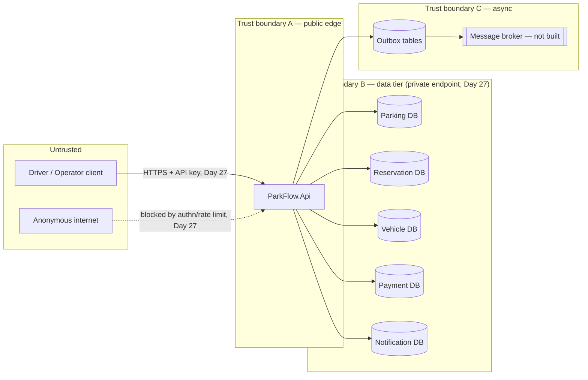

# ParkFlow — STRIDE-lite Threat Model (Day 27)

Scope: the ParkFlow capstone as scaffolded in
[day-22/piece2](../day-22/piece2/ParkFlow) and copied into
[ParkFlow/](ParkFlow/) for this security pass. Modular monolith, five modules
(Parking, Reservation, Vehicle, Payment, Notification), one ASP.NET Core API as
composition root, EF Core per module (InMemory today, SQL in the target
architecture — see `infra/`).

## 1. System diagram and trust boundaries

Boundaries that matter for this pass:

- **A — Client ↔ API.** The only boundary an external attacker can reach directly.
  Before Day 27 this boundary had **no authentication, no rate limiting, no
  request size limit, and no input validation** — anyone who could reach the
  process could call every endpoint.
- **B — API ↔ data tier.** Each module's database. Day 22 used EF Core InMemory
  (no network boundary at all); the target deployment uses Azure SQL per
  module. Day 27 puts this tier behind private endpoints (see
  `infra/`) so the databases are unreachable from the public internet even if
  the API's network is compromised.
- **C — Outbox → broker.** Internal, not attacker-reachable today (no broker is
  wired up yet per the Day 22 README) — out of scope for this pass beyond
  noting it as future work.

## 2. Assets

| Asset | Where | Sensitivity |
|---|---|---|
| Vehicle owner `UserId` + `LicensePlate` | Vehicle DB | PII — license plates identify a specific person's vehicle |
| Reservation records (`UserId`, `VehicleId`, `ParkingSpotId`, time window, `Price`) | Reservation DB | PII + billing-relevant |
| Payment records (amount, status) | Payment DB | Financial |
| Notification messages | Notification DB | Low-moderate (contains references to the above) |
| Parking availability/occupancy | Parking DB + cache | Low sensitivity, but integrity matters (double-booking) |
| Outbox rows | Per-module DB | Contains the same data as the aggregate that wrote them |

## 3. STRIDE per boundary

### 3.1 Client → API (boundary A)

| Threat | Concrete scenario in this codebase | Status before Day 27 | Day 27 mitigation |
|---|---|---|---|
| **S**poofing | No credential of any kind is required; any client can call `POST /api/reservations` as if it were any user. | Open | API-key authentication (`ApiKeyAuthenticationHandler`) required on every route except `/health` and the OpenAPI document. Documented as an interim control, not full user identity — see §5. |
| **T**ampering | `CreateReservationRequest.Price` and `LicensePlate` have no validation — a caller can submit a negative price, a 5000-character plate, or a malformed GUID string that 500s instead of 400s. | Open | `[Required]`/`[Range]`/`[StringLength]` data annotations on `CreateReservationRequest` and `RegisterVehicleRequest`, enforced via `ApiController`'s automatic model validation (already implicit from `[ApiController]`, now backed by actual constraints instead of none). |
| **R**epudiation | No request logging/correlation beyond ASP.NET Core defaults; a disputed cancellation can't be tied to a caller. | Partially open | Out of scope for this pass (would need per-user identity, not just an API key, to be meaningful — noted in §6 as follow-on work alongside Day 26's OpenTelemetry tracing, which already captures request-level spans). |
| **I**nformation disclosure | Unhandled exceptions returned ASP.NET Core's default developer exception content (stack traces) even outside `Development`; no security response headers. | Open | `app.UseExceptionHandler` with a problem-details response in non-Development environments; `X-Content-Type-Options`, `X-Frame-Options`, `Referrer-Policy`, `Content-Security-Policy` headers added. Swagger UI/OpenAPI document gated behind the same API key outside Development. |
| **D**enial of service | No request size limit, no rate limiting — a single client can flood `POST /api/reservations` or send multi-MB bodies. | Open | Fixed-window rate limiter (per API key / per IP) on all endpoints; `MaxRequestBodySize`/`[RequestSizeLimit]` caps request bodies. |
| **E**levation of privilege | **`CancelAsync`, `CheckInAsync`, `CompleteAsync` take only a `reservationId` — there is no check that the caller owns that reservation.** Any client that can guess or enumerate a GUID (e.g. from a prior response, a log, or a referrer header) can cancel or complete *any other user's* reservation. This is a classic BOLA/IDOR gap. | **Closed — pending a real IdP for the token-issuance endpoint.** (See "Day 31 close-out" below; open as of Day 27, fixed Day 29/30.) | The API-key scheme added this pass authenticates the *caller as a client of the API*, not as the specific user who owns a reservation, so it cannot close this gap by itself. Documented here as the top finding for a future pass: needs per-user identity (e.g. Entra ID, as already implemented for the separate QuotesApi track in day-25) plus an ownership check (`reservation.UserId == currentUserId`) inside `CancelAsync`/`CheckInAsync`/`CompleteAsync`. Flagging honestly rather than papering over it with a control that doesn't actually address it. |

### 3.2 API → data tier (boundary B)

| Threat | Scenario | Mitigation |
|---|---|---|
| Spoofing / Tampering | A compromised host on the same network (or a misconfigured public endpoint) reads/writes the database directly, bypassing the API's business rules entirely. | Private endpoint + VNet integration (§4) — the data tier has no public IP and only the API's subnet can reach it. |
| Information disclosure | A database with a public endpoint is discoverable and brute-forceable even if credentials are strong. | Public network access disabled on the SQL logical server (`publicNetworkAccess: 'Disabled'` in Bicep); private DNS zone so the API resolves the private IP. |
| Denial of service | Public endpoints are exposed to internet-wide connection floods even before authentication is checked. | Removed from the attack surface entirely by making the endpoint private. |

### 3.3 Outbox → broker (boundary C)

Not attacker-reachable (no external interface), and no broker is wired up in
this scaffold yet — carried over unchanged from the Day 22 README's own
"Retry/DLQ — not implemented" note. Out of scope for Day 27.

## 4. Top findings, ranked

1. **BOLA on reservation state transitions** (§3.1, Elevation of Privilege) — **closed Day 30** (pending a real IdP — see "Day 31 close-out" below). Was the highest-impact open finding as of Day 27; needed real per-user identity, which Day 29 added.
2. **No authentication at all** — fixed this pass with API-key auth (interim; see §5 for why not full OAuth2/OIDC this pass).
3. **No input validation on request DTOs** — fixed this pass with data annotations.
4. **No rate limiting / request size limits** — fixed this pass.
5. **Public data-tier network exposure in the target Azure deployment** — fixed this pass at the infra layer (private endpoints), though undeployed (see `infra/README.md` for why).
6. **Information disclosure via unhandled exceptions and missing security headers** — fixed this pass.

## 5. Why API-key auth, not Entra ID, for this pass

The sibling exercise track (`day-25/piece1`, `day-26/piece1`, a different app —
`QuotesApi`) already implements real Microsoft Entra ID app auth end-to-end,
but that work is tied to a different Azure AD app registration and a
different codebase; it is not part of the ParkFlow capstone this piece builds
on (`day-22/piece2`). Introducing the same OAuth2/OIDC machinery here would be
straightforward to wire (register a new Entra ID app, add
`Microsoft.Identity.Web`), but would not by itself fix the BOLA finding above
— that needs the *application* to check `reservation.UserId` against the
caller's identity, which is a code change independent of which authentication
scheme is used. Given the time box for this pass, a real (not stubbed)
API-key scheme was chosen so every endpoint genuinely requires a credential
and the ZAP baseline scan below runs against an authenticated posture, while
the ownership-check gap is called out explicitly rather than silently
left unaddressed.

## 6. Explicitly out of scope this pass

- Per-user identity / OAuth2 (see §5).
- Fixing the BOLA finding at the application layer (needs the above first).
- A real message broker and its own threat surface (not built yet, per the
  Day 22 README).
- Repudiation / audit logging beyond what Day 26's OpenTelemetry tracing
  already provides.

## 7. Day 31 close-out — this file is a copy; the ADR-001 track fixed the finding above

This is an unmodified-content-wise copy of day-27/piece1's THREAT-MODEL.md, edited here (not at
the original) per this piece's brief. What actually closed §3.1's finding, in order:

- **Day 29** (`day-29/piece1`): added the JWT bearer scheme (a `sub` claim = `UserId`) alongside
  the existing API key, and a composite `ApiKey AND Bearer` authorization policy on the three
  mutation routes — the identity plumbing this finding said it needed, with no ownership check
  wired up yet.
- **Day 30** (`day-30/piece1`): `CancelAsync`/`CheckInAsync`/`CompleteAsync` gained the actual
  `reservation.UserId == currentUserId` guard this finding asked for, returning `Forbidden`
  otherwise — proven by `ReservationOwnershipTests.cs` (a different user gets 403 on all three
  actions, including on a still-Pending reservation, so a non-owner can't even learn the
  reservation's real state from the error code).
- **Day 31** (this piece): re-ran the exact OWASP ZAP baseline method from §"Basic pen test"
  (day-27/piece1/SECURITY-TESTING.md) against the dual-auth posture —
  `day-31/piece1/zap/zap-baseline-report.md`: **66/66 passive rules pass, 0 High/Medium/Low, 2
  Informational** (the same two "Non-Storable Content" findings on POST endpoints Day 27 already
  had) — confirming the added bearer-token handling introduced no new passive findings. Also
  confirmed directly: `POST /api/v1/dev/token` returns a genuine 404 in a Production-postured scan
  target even with a valid API key, not just an unauthenticated 401 — the endpoint is truly absent
  outside `Development`, not just gated.

**Why "pending a real IdP" and not simply "closed"**: the fix's ownership check itself is real and
tested, but the identity behind it is still a `Development`-only token endpoint seeded with two
fixed demo users (ADR-001's accepted scope for the capstone), not a real identity provider. Build
Day 32 (stretch, per `day-28/piece1/BUILD-PLAN.md`) swaps that for Entra ID — a configuration
change only, since the ownership check only ever depends on the `sub`/`NameIdentifier` claim, never
on how it was minted.
